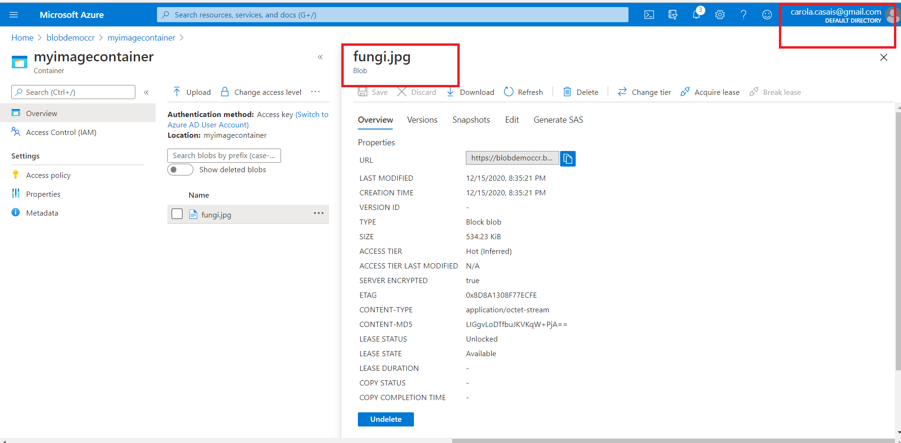

# Upload-an-Image-to-Microsoft-Azure-Blob-Storage

1. **Nombres y apellidos:** Carola Casais Recondo
2. **Fecha:** Martes 15 de diciemrbre de 2020
3. **Resumen del Ejercicio:** El objetivo del ejericio es subir una imagen al Storage Blol de Azure a través de Visual Studio 2019.
4. **Dificultad o problemas presentados y como se resolvieron:** No hubo dificultades.
